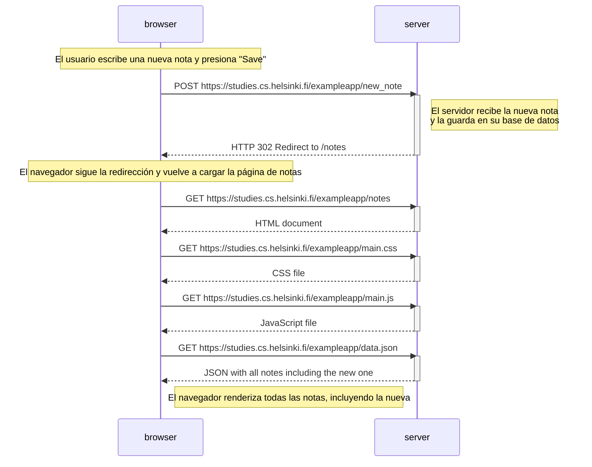

```mermaid
sequenceDiagram
    participant browser
    participant server

    Note over browser: El usuario escribe una nueva nota y presiona "Save"
    
    browser->>server: POST https://studies.cs.helsinki.fi/exampleapp/new_note 
    activate server
    Note right of server: El servidor recibe la nueva nota<br>y la guarda en su base de datos
    server-->>browser: HTTP 302 Redirect to /notes
    deactivate server

    Note over browser: El navegador sigue la redirección y vuelve a cargar la página de notas
    
    browser->>server: GET https://studies.cs.helsinki.fi/exampleapp/notes
    activate server
    server-->>browser: HTML document
    deactivate server

    browser->>server: GET https://studies.cs.helsinki.fi/exampleapp/main.css
    activate server
    server-->>browser: CSS file
    deactivate server

    browser->>server: GET https://studies.cs.helsinki.fi/exampleapp/main.js
    activate server
    server-->>browser: JavaScript file
    deactivate server

    browser->>server: GET https://studies.cs.helsinki.fi/exampleapp/data.json
    activate server
    server-->>browser: JSON with all notes including the new one
    deactivate server

    Note right of browser: El navegador renderiza todas las notas, incluyendo la nueva
```