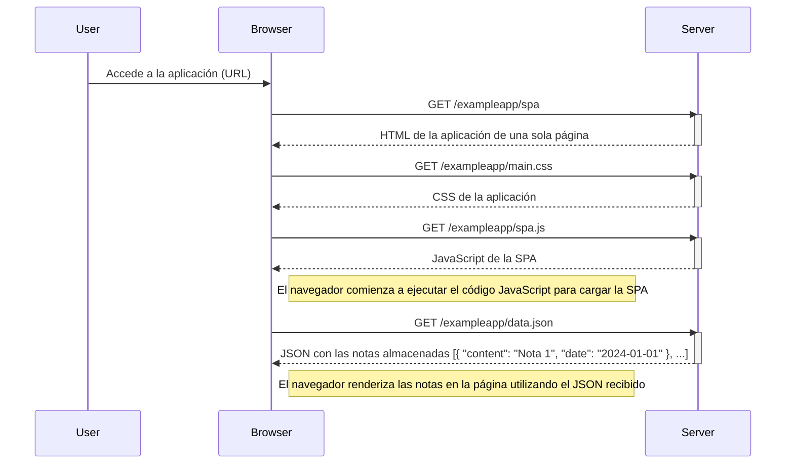

```mermaid
sequenceDiagram
    participant User
    participant Browser
    participant Server

    User->>Browser: Accede a la aplicación (URL)
    Browser->>Server: GET /exampleapp/spa
    activate Server
    Server-->>Browser: HTML de la aplicación de una sola página
    deactivate Server

    Browser->>Server: GET /exampleapp/main.css
    activate Server
    Server-->>Browser: CSS de la aplicación
    deactivate Server

    Browser->>Server: GET /exampleapp/spa.js
    activate Server
    Server-->>Browser: JavaScript de la SPA
    deactivate Server

    Note right of Browser: El navegador comienza a ejecutar el código JavaScript para cargar la SPA

    Browser->>Server: GET /exampleapp/data.json
    activate Server
    Server-->>Browser: JSON con las notas almacenadas [{ "content": "Nota 1", "date": "2024-01-01" }, ...]
    deactivate Server

    Note right of Browser: El navegador renderiza las notas en la página utilizando el JSON recibido

```