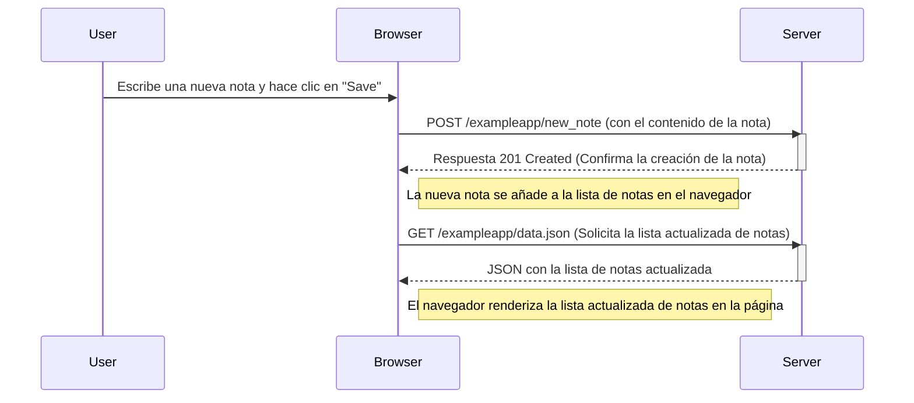

```mermaid
sequenceDiagram
    participant User
    participant Browser
    participant Server

    User->>Browser: Escribe una nueva nota y hace clic en "Save"
    Browser->>Server: POST /exampleapp/new_note (con el contenido de la nota)
    activate Server
    Server-->>Browser: Respuesta 201 Created (Confirma la creación de la nota)
    deactivate Server

    Note right of Browser: La nueva nota se añade a la lista de notas en el navegador

    Browser->>Server: GET /exampleapp/data.json (Solicita la lista actualizada de notas)
    activate Server
    Server-->>Browser: JSON con la lista de notas actualizada
    deactivate Server

    Note right of Browser: El navegador renderiza la lista actualizada de notas en la página

```